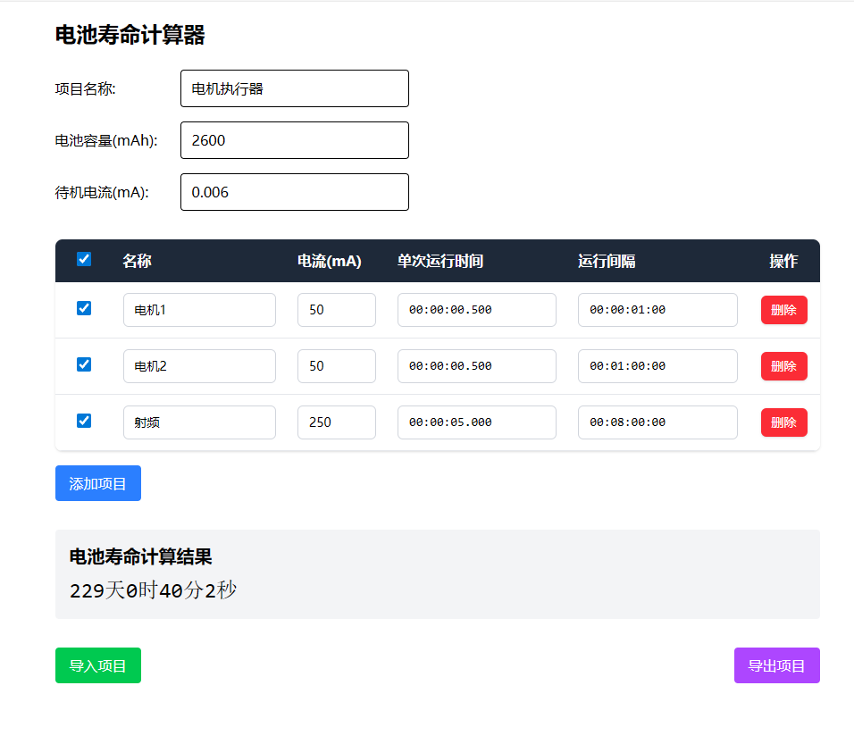

# 电池寿命计算器

一个用于估算电池续航时间的网页工具，适用于物联网设备、低功耗嵌入式系统等场景。



## 功能特点

- **全局参数设置**：配置电池容量(mAh)和待机电流(mA)
- **多负载管理**：添加多个周期性运行的负载组件
- **智能计算**：根据占空比自动计算平均电流消耗
- **启用/禁用**：通过复选框选择参与计算的负载项
- **数据导入导出**：支持项目配置的保存和加载

## 使用说明

### 1. 配置基础参数

- **项目名称**：为您的项目命名
- **电池容量**：输入电池总容量（毫安时）
- **待机电流**：设备空闲时的基础功耗（毫安）

### 2. 添加负载项

点击"添加项目"按钮，配置每个负载的参数：

| 字段 | 说明 | 格式 |
| --- | --- | --- |
| 名称 | 负载名称，如"电机"、"射频" | 任意文本 |
| 电流 | 该负载工作时的电流 | mA |
| 单次运行时间 | 每次运行持续时间 | hh:mm:ss.ms |
| 运行间隔 | 两次运行之间的时间间隔 | dd:hh:mm:ss |

### 3. 启用/禁用负载

- 勾选第一列的复选框启用该负载参与计算
- 表头全选框可一键启用/禁用所有项目
- 禁用的项目以灰色显示，不计入结果

### 4. 查看结果

页面底部实时显示电池预计续航时间，格式为：X年X天X时X分X秒

### 5. 保存与加载

- **导出项目**：将当前配置保存为 JSON 文件
- **导入项目**：加载之前保存的配置文件

## 计算原理

电池寿命 = 电池容量 ÷ 总平均电流

其中总平均电流 = 待机电流 + Σ(各负载工作电流 × 占空比)

占空比 = 单次运行时间 ÷ 运行间隔

## 技术栈

- Vue 3
- Tailwind CSS

## 本地运行

```bash
# 安装依赖
npm install

# 启动开发服务器
npm run dev

# 构建生产版本
npm run build
```

## 适用场景

- 低功耗 IoT 设备设计
- 电池选型评估
- 功耗优化分析
- 嵌入式系统开发
