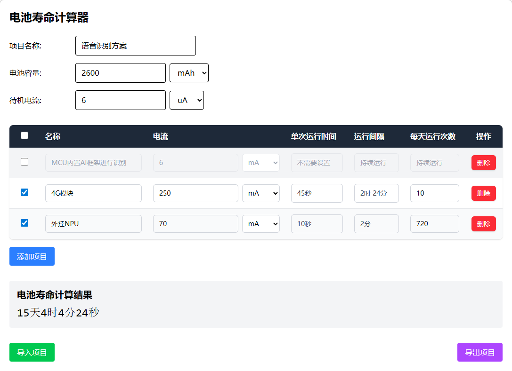
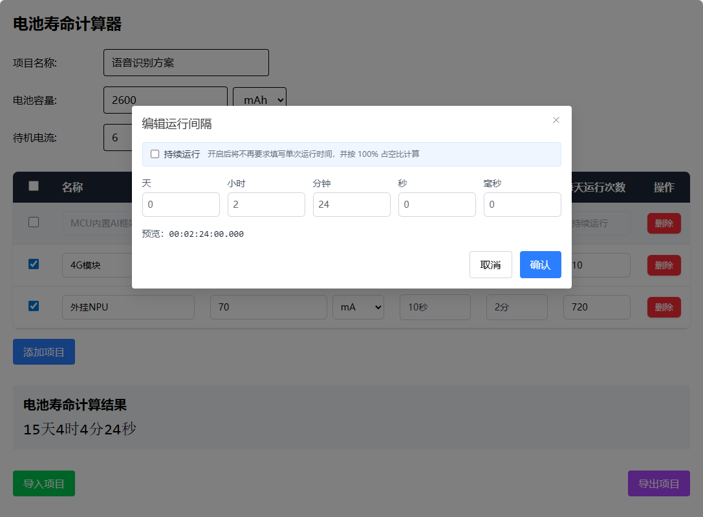

# 电池寿命计算器

一个用于估算电池续航时间的网页工具，适用于物联网设备、低功耗嵌入式系统等场景。





## 功能特点

- **全局参数设置**：支持电池容量单位（Ah / mAh / uAh / nAh）和待机电流单位（A / mA / uA / nA）
- **多负载管理**：可添加多个负载项目，并分别设置名称和启用状态
- **行级输入方式二选一**：每个负载可独立选择「电流×时长」或「单次耗电量」（Ah / mAh / uAh / nAh）两种方式之一
- **时间弹窗编辑**：单次运行时间、运行间隔通过弹窗按天 / 时 / 分 / 秒 / 毫秒编辑
- **每天运行次数联动**：运行间隔与每天运行次数可双向换算，支持小数输入
- **持续运行模式**：运行间隔可设置为“持续运行”，此时无需填写单次运行时间，并按 100% 占空比计算
- **数据导入导出**：支持项目配置的保存和加载

## 使用说明

### 1. 配置基础参数

- **项目名称**：为您的项目命名
- **电池容量**：输入电池容量，并选择容量单位
- **待机电流**：输入设备空闲时的基础功耗，并选择电流单位

### 2. 添加负载项

点击“添加项目”按钮，配置每个负载的参数：

| 字段 | 说明 |
| --- | --- |
| 名称 | 负载名称，如“电机”“射频” |
| 输入方式 | 二选一：电流×时长 / 单次耗电量 |
| 电流 / 单次耗电量 | 电流模式填工作电流并选电流单位；耗电量模式填单次消耗的电荷量并选容量单位 |
| 单次运行时间 | 电流模式下点击弹窗编辑；耗电量模式下不需要设置 |
| 运行间隔 | 点击后通过弹窗编辑间隔，或设置为持续运行 |
| 每天运行次数 | 与运行间隔双向联动；持续运行时不适用 |

### 3. 启用/禁用负载

- 勾选第一列复选框启用该负载参与计算
- 表头全选框可一键启用/禁用所有项目
- 禁用项目会以灰色显示，不计入结果

### 4. 时间编辑规则

- 时间通过弹窗分别输入天、小时、分钟、秒、毫秒
- 运行间隔支持设置为“持续运行”
- 电流模式下，运行间隔必须大于等于单次运行时间
- 持续运行模式下，无需填写单次运行时间
- 耗电量模式下无需填写单次运行时间，也不参与上述交叉校验；此时设置“持续运行”，数值按每天耗电量计算

### 5. 保存与加载

- **导出项目**：将当前配置保存为 JSON 文件
- **导入项目**：加载之前保存的配置文件

### 6. 查看结果

页面底部会实时显示预计续航时间，格式为：`X年X天X时X分X秒`

## 计算原理

电池寿命 = 电池容量 ÷ 总平均电流

其中：

- 总平均电流 = 待机电流 + Σ(各负载平均电流)
- 电流模式周期任务的平均电流 = 工作电流 × (单次运行时间 ÷ 运行间隔)
- 电流模式持续运行任务的平均电流 = 工作电流
- 耗电量模式周期任务的平均电流 = 单次耗电量 ÷ 运行间隔
- 耗电量模式持续运行任务的平均电流 = 每天耗电量 ÷ 24h

## 技术栈

- Vue 3
- Vite
- Tailwind CSS
- Element Plus

## 本地运行

```bash
# 安装依赖
npm install

# 启动开发服务器
npm run dev

# 运行测试
npm test

# 构建生产版本
npm run build
```

## 适用场景

- 低功耗 IoT 设备设计
- 电池选型评估
- 功耗优化分析
- 嵌入式系统开发
